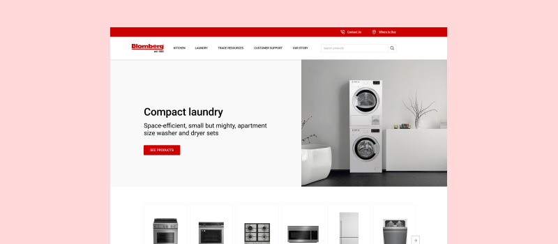

# Improving an appliance website experience for builders, architects, and designers.
#### Year: 2019-2020 | Designers: Clara Shen, Danuta Sęczkowska

As part of the SNOW.DOG UX team, I helped Blomberg Appliances realign and transform their website experience to position their brand as a key partner for architects, developers and builders. 

A key motivation for this redesign was the repositioning of the brand, so user research with a dedicated target group was extremely important. It gave us a lot of key insights that helped us prepare the new information architecture, content strategy and ultimate design.

[Read the full case study on Medium.](https://medium.com/snowdog-labs/improving-an-appliance-website-experience-for-builders-architects-and-designers-10168aa12a78)

